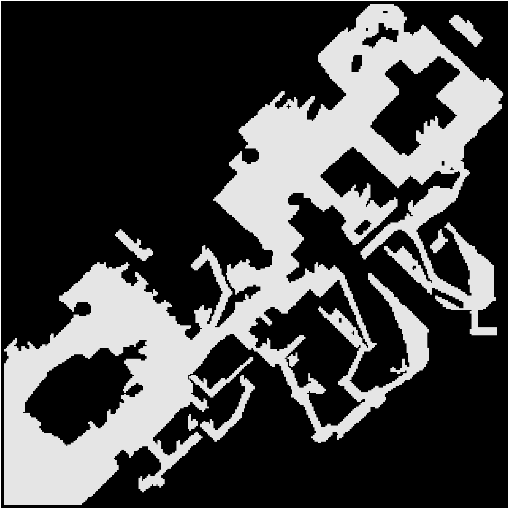
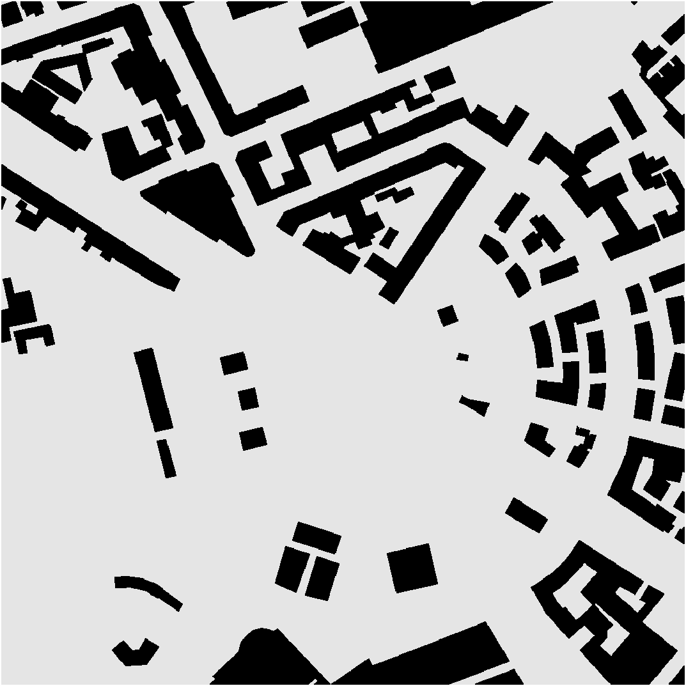
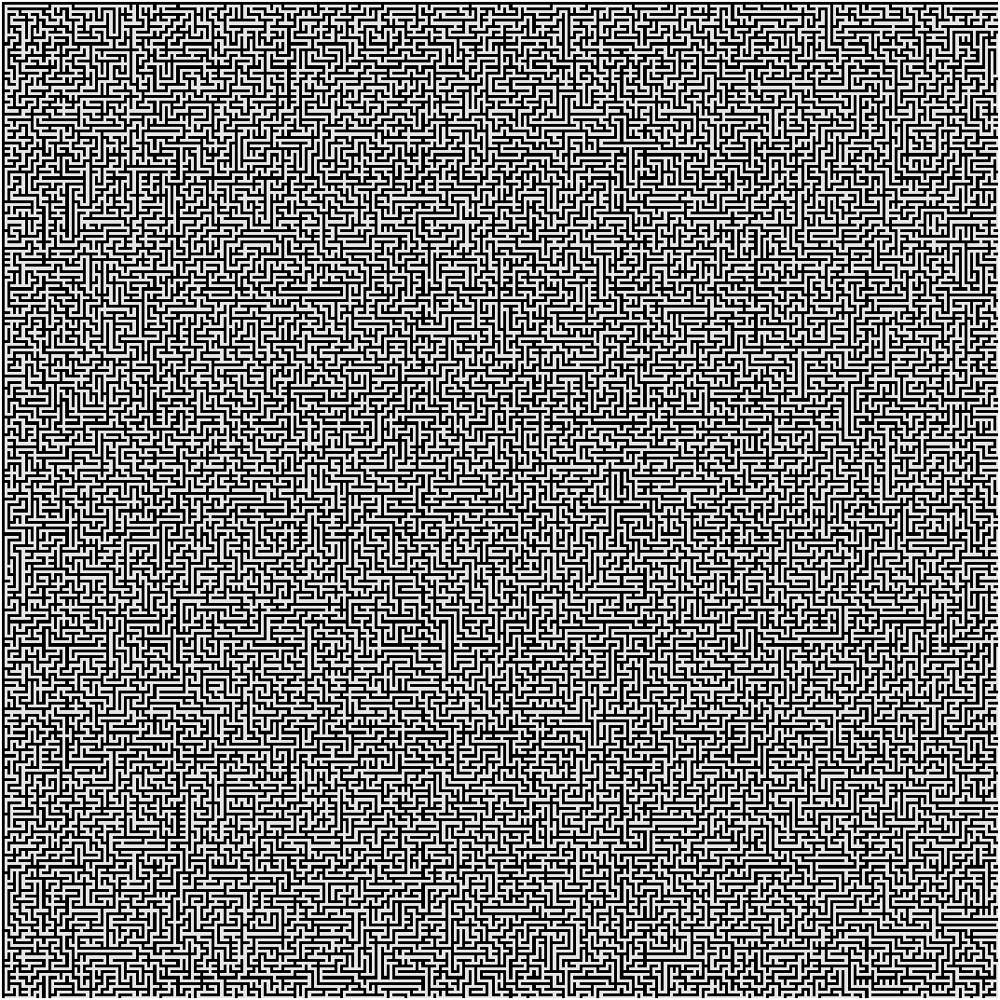
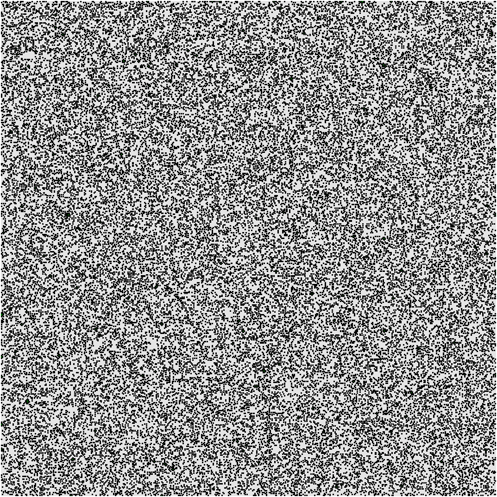

# Any-angle-pathfinding-benchmark

Source of `Theta*` code: https://github.com/Ohohcakester/Any-Angle-Pathfinding 

Source of `A*` code: https://github.com/riscy/a_star_on_grids

Source of `Anya` and `PolyAnya` code: https://bitbucket.org/dharabor/pathfinding/src/master/anyangle/

## Benchmark

Benchmark results are located in `results` folder.

Maps: AR0500SR, Milan_1_1024, maze512-2-5, random512-20-0.

AR0500SR            |  Milan_1_1024           | maze512-2-5            | random512-20-0            
:-------------------------:|:-------------------------:|:-------------------------:|:-------------------------:
 |    |     |  

Maps source: https://movingai.com/benchmarks/grids.html 

## Usage

#### A*

```bash
cd astar/src
./run_benchmarks.sh 
```

#### Theta*
Run bash script to build project, run benchmarks and process data:
```bash
cd theta_star
./run_benchmarks.sh 
```

#### Anya
Run script to get results of basic anya algorithm and java implementation of astar:
```bash
cd anya
sh run_benchmarks.sh
```

#### PolyAnya
Run script to get results of polyanya on cdt, m-cdt and rec meshes:
```bash
cd polyanya
sh run_benchmarks.sh
```

## Data visualization

When all benchmarks are completed, run Jupyter notebook `analysis.ipynb`
